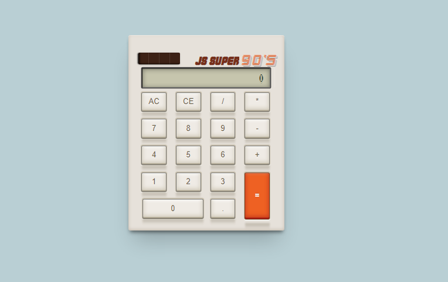

# React Old School calculator

I made this project as part of the Free code camp certification program
The design is inspired by old calculators from the 80/90's.

I used css grid for most of the buttons and followed [this article](https://dev.to/catlogic/styling-the-catlogic-calculator-in-css-d7i)
for the solar panel.

This was a nice way to familiarize myself with react states, objects, switch cases and css grids.

# Live preview of the project

you can check this project [here](https://ihsenben.github.io/oldschool_calculator-FCC/)

